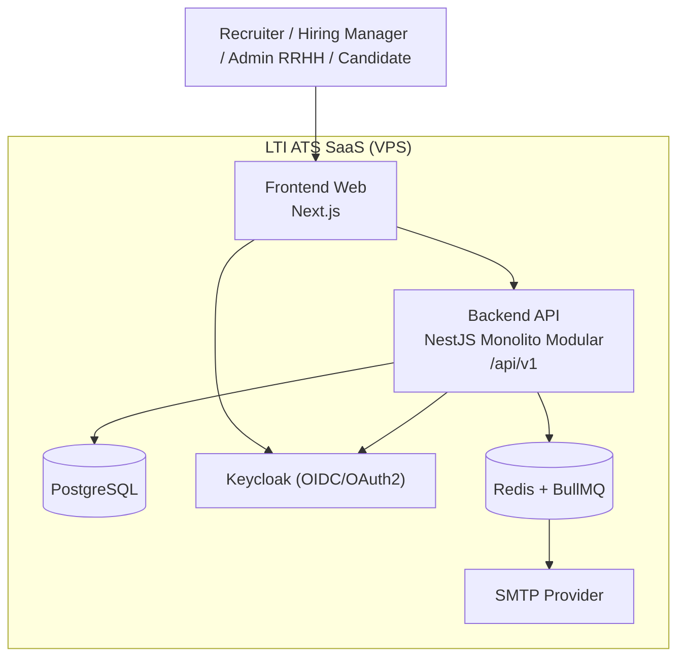
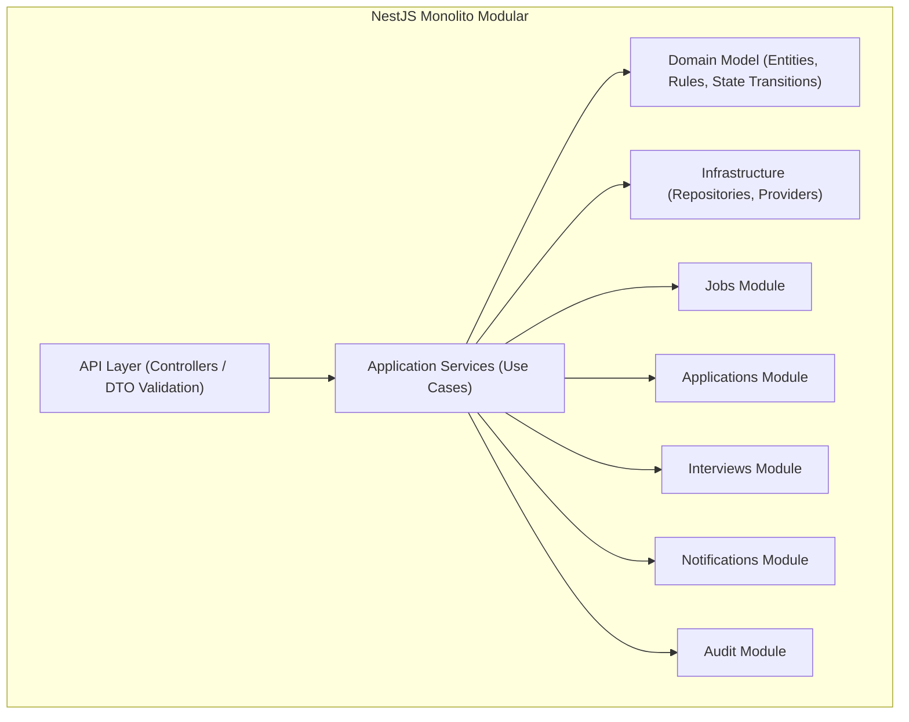

# Arquitectura de Software

## Estilo Arquitectonico

Se adopta una arquitectura de **monolito modular** en un **monorepo** con:

- `frontend`: Next.js (React)
- `backend`: NestJS (Node.js)
- `database`: PostgreSQL
- `iam`: Keycloak
- `queue`: Redis + BullMQ

Aunque el backend sea monolitico, el frontend se comunica por **API REST** para desacoplar interfaces, facilitar pruebas E2E, habilitar versionado y permitir evolucion futura (mobile, integraciones externas o separacion fisica progresiva).

## Justificacion de REST en Monolito

No se usa REST por necesidad de microservicios, sino por gobernanza de contratos:

- define una frontera clara entre UI y dominio;
- evita acoplamiento directo del frontend a servicios internos;
- facilita versionado (`/api/v1`) y observabilidad por endpoint;
- simplifica seguridad (OIDC/JWT) y politicas de autorizacion.

## Vista de Contenedores (C4 - Nivel 2)

## Vista de Componentes del Backend (C4 - Nivel 3)

## Modulos Iniciales

- `candidates`: directorio de candidatos (talent pool) sin vacante obligatoria; documentos asociados.
- `jobs`: ciclo de vida de vacantes.
- `applications`: gestion de postulaciones y cambios de etapa.
- `assessments`: pruebas en linea.
- `interviews`: agenda y scorecards.
- `offers`: decision final de contratacion.
- `notifications`: eventos y envio de emails.
- `audit`: trazabilidad obligatoria (creacion, cambios, asignaciones, decision final).
- `tenancy`: enforcement de `tenant_id` por solicitud.

## Modelo Multi-tenant

- Estrategia inicial: **shared database, shared schema, row-level tenanting** con `tenant_id`.
- Regla tecnica: ninguna consulta de negocio se ejecuta sin filtro por `tenant_id`.
- Riesgo controlado: validaciones y pruebas automatizadas para evitar fugas cross-tenant.

## Diseno Asincrono (Colas)

Se implementan colas en el backend para procesos no criticos al tiempo de respuesta del usuario:

- envio de emails de notificacion;
- tareas de publicacion externa (futuro);
- recordatorios y tareas diferidas de entrevistas;
- procesamiento de eventos de auditoria masiva (si aplica).

### Flujo recomendado

1. Use case cambia estado en transaccion principal.
2. Se publica un evento de dominio.
3. El `notifications worker` consume desde BullMQ.
4. Se ejecuta envio SMTP con reintentos y registro de resultado.

Este enfoque mantiene respuestas rapidas en UI y mejora resiliencia operativa.

## Persistencia y Acceso a Datos

Se recomienda **Prisma ORM** para este contexto por:

- curva de aprendizaje rapida;
- tipado fuerte con TypeScript;
- migraciones y esquema claros para 1 desarrollador;
- buena productividad en MVP.

TypeORM sigue siendo valido, pero Prisma aporta mayor velocidad y consistencia para este proyecto.

## Seguridad

- OIDC/OAuth2 con Keycloak.
- MFA obligatorio para administradores.
- JWT validado en backend por rol y tenant.
- Cifrado en transito (TLS) y en reposo.

## Trade-offs de la Arquitectura Elegida

- Se prioriza simplicidad operativa y costo bajo sobre elasticidad avanzada.
- Monolito modular reduce complejidad de despliegue frente a microservicios.
- REST agrega una capa de contrato, pero evita acoplamiento y acelera evolucion futura.

## Diagrama de Contenedores

---
[⬅️ Volver al Índice](00.index.md)
