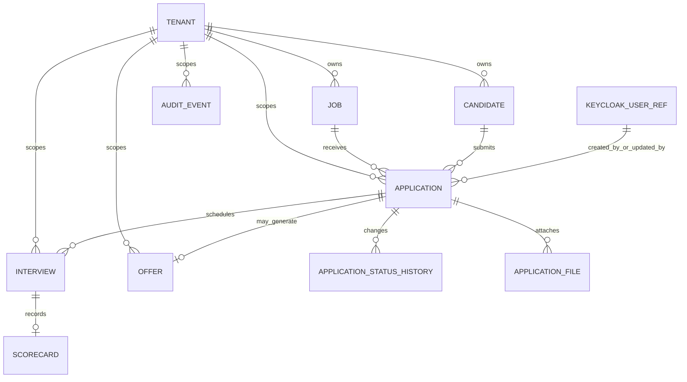

# 🗄️ Datos

## 🗺️ Diagrama de Entidad-Relación (MER)

## 📖 Diccionario de Entidades y Diccionario de Datos Clave

### `tenant`

- `id` (uuid, pk)
- `name` (varchar)
- `plan` (enum: free, pro)
- `created_at`, `updated_at`, `deleted_at`

### `job`

- `id` (uuid, pk)
- `tenant_id` (uuid, fk)
- `title`, `area`, `modality`, `location`, `salary`, `description`
- `vacancies_count` (int)
- `status` (enum: draft, published, paused, closed)
- `closing_date` (date)
- `created_at`, `updated_at`, `deleted_at`

### `candidate`

- `id` (uuid, pk)
- `tenant_id` (uuid, fk)
- `full_name`, `email`, `phone`, `experience_summary`
- `created_at`, `updated_at`, `deleted_at`

### `application`

- `id` (uuid, pk)
- `tenant_id` (uuid, fk)
- `job_id` (uuid, fk)
- `candidate_id` (uuid, fk)
- `status` (enum: new, in_review, in_test, interview, offer, hired, rejected)
- `cv_url` (text)
- `keycloak_user_id` (varchar, referencia externa)
- `created_at`, `updated_at`, `deleted_at`

### `application_file`

- `id` (uuid, pk)
- `tenant_id` (uuid, fk)
- `application_id` (uuid, fk)
- `file_type` (enum: cv, portfolio, certificate, other)
- `file_url` (text)
- `created_at`

### `application_status_history`

- `id` (uuid, pk)
- `tenant_id` (uuid, fk)
- `application_id` (uuid, fk)
- `from_status`, `to_status`
- `changed_by_keycloak_user_id`
- `changed_at`
- `reason` (nullable)

### `interview`

- `id` (uuid, pk)
- `tenant_id` (uuid, fk)
- `application_id` (uuid, fk)
- `scheduled_at` (timestamp)
- `interviewer_keycloak_user_id`
- `status` (enum: scheduled, completed, cancelled)
- `created_at`, `updated_at`

### `scorecard`

- `id` (uuid, pk)
- `tenant_id` (uuid, fk)
- `interview_id` (uuid, fk, unique)
- `score` (numeric)
- `feedback` (text)
- `created_at`, `updated_at`

### `offer`

- `id` (uuid, pk)
- `tenant_id` (uuid, fk)
- `application_id` (uuid, fk, unique)
- `status` (enum: pending, accepted, rejected, expired)
- `salary_offer` (numeric)
- `created_at`, `updated_at`

### `audit_event` (auditoria funcional)

- `id` (uuid, pk)
- `tenant_id` (uuid, fk)
- `entity_type`, `entity_id`
- `event_type` (created, status_changed, assignment_changed, final_decision)
- `actor_keycloak_user_id`
- `payload` (jsonb)
- `occurred_at`

### `technical_audit_log` (auditoria tecnica)

- `id` (uuid, pk)
- `tenant_id` (uuid, fk, nullable)
- `trace_id`
- `level`, `message`
- `context` (jsonb)
- `created_at`

### `keycloak_user_ref`

Tabla ligera de referencia (opcional, sin replicar identidad completa) para correlacion interna:

- `keycloak_user_id` (pk, varchar)
- `last_seen_at`

## 🔗 Relaciones y Cardinalidades

- Un `tenant` tiene muchas `jobs`, `candidates`, `applications`, `interviews`, `offers` y eventos de auditoria.
- Una `job` recibe muchas `applications`.
- Un `candidate` puede postular a muchas `jobs` (via `application`).
- Una `application` tiene historial de estados, archivos adjuntos y cero o muchas entrevistas.
- Una `interview` puede tener un `scorecard` unico.
- Una `application` puede generar una `offer` unica.
- Los usuarios viven en Keycloak; la aplicacion guarda solo referencias (`keycloak_user_id`).

## ⚡ Índices y Optimizaciones

- Indices obligatorios en todas las tablas de negocio:
  - `(tenant_id)`
  - `(tenant_id, status)`
  - `(tenant_id, created_at desc)`
- Indices de relacion:
  - `application(job_id)`
  - `application(candidate_id)`
  - `interview(application_id, scheduled_at)`
- Unicidad recomendada:
  - `offer(application_id)` unico
  - `scorecard(interview_id)` unico
- Considerar `GIN` en columnas `jsonb` de auditoria si el volumen crece.

## 🚀 Consideraciones de Escalabilidad

- Estrategia inicial multi-tenant por fila (`tenant_id`) en esquema compartido.
- Preparar particionamiento por fecha para `audit_event` y `technical_audit_log` cuando aumente volumen.
- Evitar consultas cross-tenant en capa de aplicacion y repositorios.
- Usar paginacion en listados de vacantes y candidaturas.

## 🗄️ Almacenamiento Físico Secundario

- Archivos (CV y anexos) fuera de la BD (filesystem/objeto), guardando solo URL/metadatos.
- Retencion de logs operativos: 3 meses.
- **Backup recomendado para esta fase:** backup completo diario de PostgreSQL.
- Retencion sugerida de backups: 14-30 dias, segun capacidad de almacenamiento.
- Verificacion automatica semanal de restauracion para asegurar RPO/RTO definidos.
- Evolucion futura: sumar incrementales/WAL shipping cuando el volumen lo requiera.

---
[⬅️ Volver al Índice](00.index.md)
