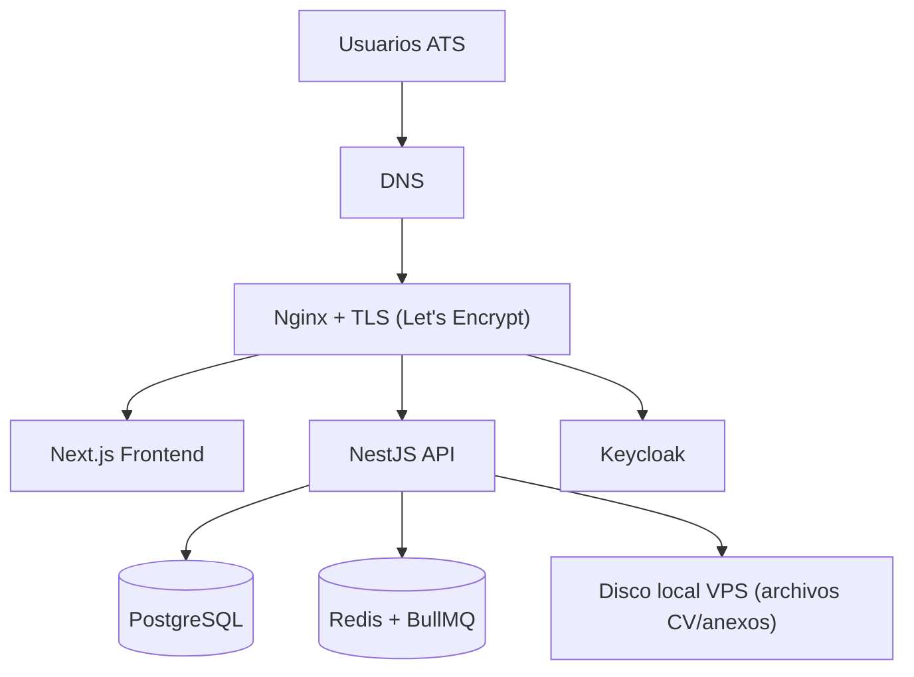

# ☁️ Arquitectura de Infraestructura (IaaS)

## Topologia Inicial (MVP)

Se define una infraestructura **single-VPS** para minimizar costo y complejidad operativa:

- `frontend` (Next.js)
- `backend` (NestJS)
- `postgres` (base de datos)
- `redis` (colas BullMQ)
- `keycloak` (identidad)
- `nginx` (reverse proxy)

Todos los componentes se ejecutan en contenedores Docker sobre un VPS Linux.

## Sistema Operativo Base

- **Ubuntu 24.04 LTS** (recomendado y aprobado para este proyecto).

## Reverse Proxy y Enrutamiento

Se adopta **Nginx** como reverse proxy de entrada.

### Justificacion de Nginx

- configuracion simple para un entorno de 1 VPS;
- bajo consumo de recursos;
- ecosistema maduro y muy documentado;
- integracion directa con certificados TLS y proxy por subdominios.

## Cifrado y Seguridad de Transporte

Se habilita **TLS obligatorio** con **Let's Encrypt** (renovacion automatica).

### Razon

- protege credenciales y datos personales de candidatos;
- es requisito practico para OIDC/OAuth2 en produccion;
- no incrementa costos de licenciamiento.

## Estrategia de Dominios

Se recomienda el siguiente esquema:

- `app.<dominio>` -> Frontend
- `api.<dominio>` -> Backend
- `auth.<dominio>` -> Keycloak

Ejemplo:

- `app.lti-ats.com`
- `api.lti-ats.com`
- `auth.lti-ats.com`

## Diagrama de Infraestructura (MVP)

## Almacenamiento y Estado

- **Base de datos y Redis** en el mismo VPS durante fase inicial.
- **Archivos** (CV/anexos) en disco local del VPS (con estructura por tenant).
- Politicas de rotacion y limpieza para evitar saturacion de almacenamiento.

## Observabilidad Basica

Se implementa un baseline operativo:

- Uptime checks (por ejemplo, Uptime Kuma).
- Logs centralizados por contenedor.
- Metricas de host y servicios (Node Exporter/Prometheus o equivalente lightweight).
- Health checks de frontend, backend, DB y Keycloak.

## Backup y Recuperacion

- Backups almacenados en el **mismo VPS** en esta fase.
- Frecuencia: backup completo diario de PostgreSQL.
- Verificacion periodica de restauracion.
- Plan de evolucion: copia externa de backups cuando se incremente criticidad o volumen.

## Despliegue Operativo

Estrategia inicial de despliegue:

- `docker compose pull`
- `docker compose up -d`

Con rollback por imagen previa y backup reciente de base de datos antes de cambios de version.

## Riesgos Aceptados en Fase Inicial

- Unico punto de falla por arquitectura single-VPS.
- Capacidad limitada por recursos verticales del servidor.
- Backups locales sin redundancia externa en el inicio.

Estos riesgos son aceptables para MVP low-cost y se revisaran en la siguiente etapa de crecimiento.

---
[⬅️ Volver al Índice](00.index.md)
