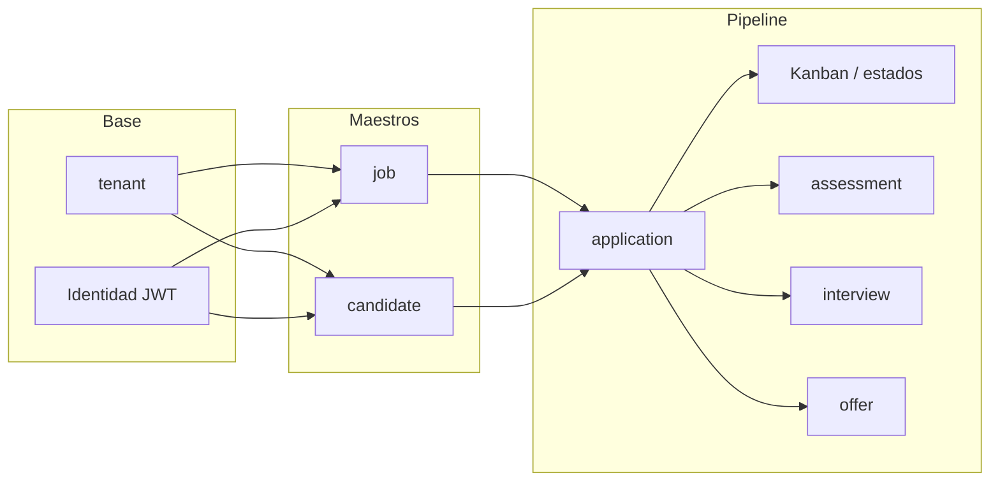

# Product Backlog (LTI ATS)

Documento vivo del **Product Backlog** priorizado: épicas, historias de usuario sugeridas y **orden recomendado** segun **dependencias de dominio** (`docs/08.data.md`, MER) y flujo funcional (`docs/02.functional_summary.md`). El PM mantiene prioridad real en Jira/backlog operativo; aqui se fija **linea base** y criterios de troceo.

---

## Dependencias entre dominios (resumen)

| Depende de | Dominio / entrega |
| :--- | :--- |
| — | Fundamentos API, modelo `tenant`, contexto `tenant_id` por request |
| `tenant` + identidad | Todas las entidades de negocio multi-tenant |
| Identidad (Keycloak/JWT) | Autorizacion por rol en endpoints y UI |
| `job`, `candidate` | `application` (candidatura) |
| `application` | Pipeline Kanban de postulaciones, `application_status_history`, pruebas, entrevistas, ofertas |
| `application` (etapas) | Notificaciones ligadas a transiciones (puede ir detras con colas) |
| Mutaciones de negocio relevantes | `audit_event` (trazabilidad) |

---

## Como trocear historias: ABM / CRUD frente a tableros Kanban

### Gestion administrativa de un dominio (vacantes, candidatos, empresas/tenant, etc.)

**Recomendacion por defecto:** **una historia de usuario por capacidad de negocio cohesiva** (ej. *Como reclutador quiero gestionar el directorio de vacantes para crear, consultar, editar y dar de baja ofertas*), con **criterios de aceptacion** que cubran explicitamente:

- alta (create);
- detalle por id (find by id);
- listado con **filtros y paginacion** (search);
- edicion (update);
- baja o baja logica segun regla de dominio (delete).

**Por que no una US por cada caso de uso:** en backend los **cinco casos de uso** (Create, Update, Delete, FindById, Search) son **obligatorios tecnicamente** para pantallas de administracion CRUD (`docs/07.code_and_technical_design.md`, ADR-010), y el comando **`plan-backend-ticket`** ya descompone en archivos y puertos. Partir en cinco US suele **fragmentar el valor** para el usuario y multiplicar integraciones FE/QA sin beneficio claro.

**Cuando si conviene partir o usar subtareas:**

- **Entrega incremental:** si el negocio exige publicar solo "alta + listado" en un sprint y dejar delete para otro, usar **dos US** o una US con **subtareas / criterios priorizados** (Must / Later).
- **Riesgo o complejidad desigual:** search con muchos filtros, full-text o reportes → US o subtarea dedicada.
- **Reglas legales:** borrado/anonymization diferido → US aparte.

En todos los casos, en la US indicar que el backend seguira el **perfil hexagonal de cinco casos de uso** cuando sea pantalla de administracion CRUD (`specs/.agents/project-manager.md`).

### Pantallas tipo tablero Kanban (vacantes por estado, candidatos por etapa en una vacante)

**Recomendacion:** **historias separadas** del ABM del mismo agregado:

- **Distinta intencion de usuario:** visualizar y **mover** tarjetas entre columnas (estado), no rellenar formularios de ficha.
- **Distinta carga tecnica:** consultas agregadas, optimizacion de lista, drag-and-drop, posibles **reglas de transicion** (que estados son validos).
- **SRP:** el tablero puede apoyarse en `Search` + `Update` de estado, pero la **experiencia y criterios** deben vivir en una US propia (ej. *Como reclutador quiero ver las postulaciones de una vacante en un tablero por etapa y arrastrar candidatos entre columnas para avanzar el proceso*).

Orden sugerido: tener **ABM minimo** o al menos **Search + FindById + Update de estado** del agregado subyacente **antes** o **en el mismo sprint** que el Kanban, para no construir solo UI sin API estable.

---

## Ondas de ejecucion sugeridas (orden macro)

Las ondas respetan dependencias; dentro de cada onda el PM puede reordenar por valor de negocio si no rompe prerequisitos.

| Onda | Enfoque |
| :--- | :--- |
| **0** | Monorepo, CI, API `/api/v1`, salud, Prisma + `tenant`, propagacion `tenant_id` |
| **1** | Integracion identidad (JWT Keycloak), roles en backend/FE, MFA admin segun producto |
| **2** | Maestros: **jobs** (vacantes), **candidates** (directorio + CV) — pueden solaparse tras tenant estable |
| **3** | **applications** + historial de estado + **tablero Kanban** por vacante |
| **4** | Pruebas en linea (**assessments**), **interviews** + scorecards, **offers** |
| **5** | Notificaciones (colas), auditoria operativa, publicacion en canales, portal candidato |

---

## Epicas e historias de usuario (linea base)

Identificadores `US-xxx` son referencia de documentacion; en Jira se mapean a claves propias.

La columna **Detalle** enlaza a la **especificacion enriquecida** en `specs/user-stories/` cuando exista; mientras tanto `—`. Ver seccion [Enriquecimiento de historias](#enriquecimiento-de-historias).

### E0 — Plataforma y datos base

| Id | Historia (resumen) | Notas / dependencias | Detalle |
| :--- | :--- | :--- | :--- |
| US-001 | Como operador quiero API versionada (`/api/v1`) con health check para desplegar y monitorizar el servicio. | Base de todos los modulos. | [Spec](../specs/user-stories/US-001-api-version-health.md) |
| US-002 | Como sistema quiero persistir `tenant` y asociar cada request de negocio a un `tenant_id` fiable (JWT + guards). | Prerequisito multi-tenant (`docs/08.data.md`). | — |

### E1 — Identidad y acceso

| Id | Historia (resumen) | Notas / dependencias | Detalle |
| :--- | :--- | :--- | :--- |
| US-010 | Como sistema quiero validar JWT de Keycloak y resolver rol + tenant para autorizar endpoints. | Depende US-002. | — |
| US-011 | Como usuario quiero iniciar sesion en el frontend (OIDC/NextAuth) y acceder solo a datos de mi tenant. | Acoplado BE+FE; contrato de sesion. | — |
| US-012 | Como admin RRHH quiero que el acceso administrativo exija MFA segun politica de producto. | `docs/03.quality_attributes.md`. | — |

### E2 — Vacantes (`job`)

| Id | Historia (resumen) | Notas / dependencias | Detalle |
| :--- | :--- | :--- | :--- |
| US-020 | Como reclutador quiero **gestionar vacantes** (alta, consulta por id, listado filtrado/paginado, edicion, baja) para mantener el catalogo de ofertas. | **Una US ABM**; backend cinco casos de uso; estados `draft`/`published`/… en `docs/02`. | — |
| US-021 | Como reclutador quiero **cambiar el estado** de una vacante (borrador → publicada → pausada → cerrada) con reglas coherentes. | Puede fusionarse en US-020 si los criterios lo cubren; si no, US aparte sobre misma entidad. | — |
| US-022 | Como reclutador quiero un **tablero tipo Kanban de vacantes** por estado para ver de un vistazo el pipeline de ofertas. | **Separada** de US-020; consume listados/agregados. | — |

### E3 — Directorio de candidatos (`candidate`, `candidate_file`)

| Id | Historia (resumen) | Notas / dependencias | Detalle |
| :--- | :--- | :--- | :--- |
| US-030 | Como reclutador quiero **gestionar candidatos** en el directorio (ABM + busqueda con filtros y paginacion) para mantener el talent pool sin vacante obligatoria. | **Una US ABM**; email unico por tenant; `docs/02`, `docs/08`. | — |
| US-031 | Como reclutador quiero **adjuntar CV** (PDF/DOCX) a un candidato con validacion de tipo y tamano. | Depende US-030 o misma epica; multipart (`docs/07`). | — |

### E4 — Candidaturas (`application`)

| Id | Historia (resumen) | Notas / dependencias | Detalle |
| :--- | :--- | :--- | :--- |
| US-040 | Como reclutador quiero **registrar una candidatura** vinculando candidato y vacante para iniciar el proceso. | Requiere **job** + **candidate** disponibles. | — |
| US-041 | Como reclutador quiero **listar y filtrar candidaturas** por vacante y por candidato para trabajar el pipeline. | Search con criterios documentados. | — |
| US-042 | Como reclutador quiero un **tablero Kanban de candidatos por etapa** en una vacante y **mover** tarjetas entre columnas alineado a estados de candidatura. | **Separada** del ABM; transiciones + `application_status_history`. | — |
| US-043 | Como sistema quiero **auditar cambios de estado** de candidatura con usuario y marca de tiempo. | Puede integrarse en US-042 o epica auditoria. | — |

### E5 — Evaluacion, entrevistas, oferta

| Id | Historia (resumen) | Notas / dependencias | Detalle |
| :--- | :--- | :--- | :--- |
| US-050 | Como reclutador quiero **gestionar pruebas en linea** asociadas a la candidatura segun flujo definido. | Depende US-040+. | — |
| US-051 | Como reclutador/hiring manager quiero **agendar entrevistas** y registrar **scorecard** por candidatura. | Depende `application`; ver `docs/08.data.md` interview/scorecard. | — |
| US-052 | Como reclutador quiero **registrar oferta** y estado final (contratada/rechazada) alineado al modelo de datos. | Depende US-040+. | — |

### E6 — Notificaciones, canales, candidato externo, auditoria

| Id | Historia (resumen) | Notas / dependencias | Detalle |
| :--- | :--- | :--- | :--- |
| US-060 | Como sistema quiero **notificar** por email eventos clave (postulacion, cambio de etapa, entrevista) usando colas. | BullMQ; no bloquear request sincrono. | — |
| US-061 | Como reclutador quiero **publicar** vacantes en canales habilitados (ej. LinkedIn, web propia) segun alcance MVP. | Depende vacantes publicables. | — |
| US-062 | Como candidato quiero **postularme** a vacantes publicadas y **ver el estado** de mi proceso. | Flujo publico + permisos; depende jobs publicados + applications. | — |
| US-063 | Como admin RRHH quiero **consultar trazas de auditoria** de acciones criticas segun `docs/02.functional_summary.md`. | Transversal; puede implementarse por fases. | — |

---

## Enriquecimiento de historias

El backlog en este archivo es un **indice del PMV** (prioridad, dependencias, resumen en una linea). El **detalle** listo para `plan-backend-ticket` / `plan-frontend-ticket` vive en **`specs/user-stories/US-<id>-<slug>.md`**.

| Opcion | Uso |
| :--- | :--- |
| **Solo indice en `docs/14`** | Mala idea para el cuerpo completo de la US: el fichero crece, los diffs mezclan epica con Gherkin y hay mas conflictos en git. |
| **Solo ficheros sueltos sin indice** | Se pierde la vision de dependencias y orden; el PMV queda disperso. |
| **Hibrido (recomendado)** | `docs/14` conserva tablas + columna **Detalle** con enlace al spec; cada US enriquecida tiene su Markdown en `specs/user-stories/`. |

Comando: **`specs/.commands/enrich-us.md`** (ver seccion *Persistencia* alli). Plantilla: `specs/user-stories/_template.md`; convenciones: `specs/user-stories/README.md`.

---

## Empresas y tenant

En el modelo actual el **tenant** agrupa datos de la organizacion cliente (PYME). Si el producto distingue **varias empresas** bajo un mismo tenant o requiere ABM de "empresa" como entidad aparte, el PM debe añadir epica explicita **tras** US-002 y **antes** de maestros que cuelguen de esa relacion. Actualizar este documento y `docs/08.data.md` con ADR si aparece nueva entidad.

---

## Referencias

- Flujo funcional y roles: `docs/02.functional_summary.md`
- MER y entidades: `docs/08.data.md`
- CRUD admin / cinco casos de uso: `docs/07.code_and_technical_design.md`
- Planificacion tecnica: `specs/.commands/plan-backend-ticket.md`, `specs/.commands/plan-frontend-ticket.md`
- Flujo de desarrollo: `workflows/development_workflow.md`

---
[⬅️ Volver al Indice](00.index.md)
