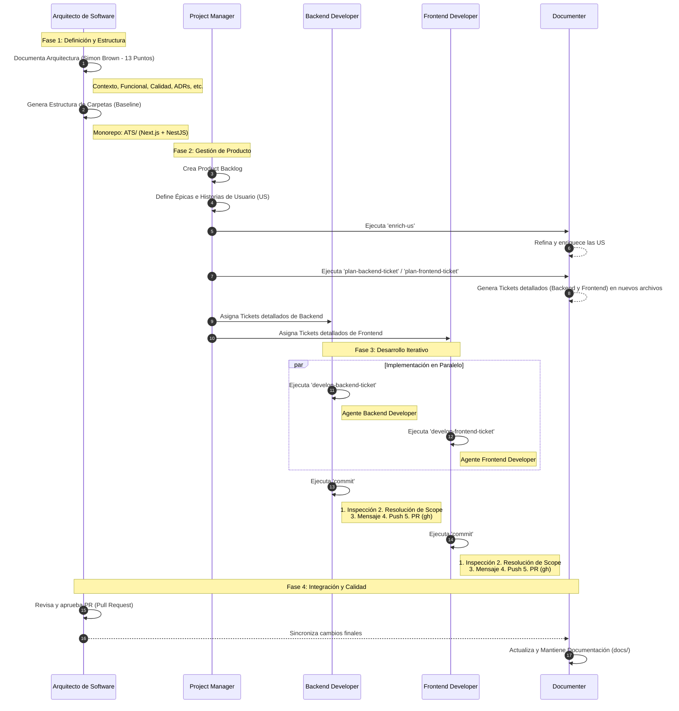

# Flujo de Desarrollo LTI ATS

Este diagrama representa el ciclo de desarrollo y los roles involucrados en el proyecto, siguiendo la arquitectura de Simon Brown y la estructura de 13 puntos establecida.

## Roles y Responsabilidades

- **Arquitecto de Software**: Responsable de la visión técnica inicial, los 13 puntos de documentación y el **visto bueno final (aprobación de PRs)** creados por el comando `commit`.
- **Project Manager**: Gestiona el backlog y coordina el refinamiento de tareas.
- **Documenter**: Agente transversal que:
    1. Enriquece las Historias de Usuario mediante el comando `enrich-us`.
    2. Genera tickets técnicos detallados para Backend y Frontend mediante los comandos `plan-backend-ticket` y `plan-frontend-ticket`.
    3. Mantiene la documentación técnica en `docs/` sincronizada.
- **Backend Developer / Frontend Developer**: Agentes que implementan servicios/UI y utilizan el comando **`commit`** para:
  - **Resolver el alcance**: Identificar qué archivos pertenecen a qué funcionalidad.
  - **Garantizar estándares**: Generar mensajes de commit descriptivos en inglés.
  - **Automatizar entrega**: Realizar push y crear/actualizar la Pull Request para revisión.
